# LearnLoop - Student Management System

## Project Description

LearnLoop is a comprehensive web-based Student Management System designed to streamline educational processes by enabling students and teachers to manage classes, assignments, notes, and communication in one unified platform. Built with Spring Boot for the backend and HTML, CSS, and JavaScript for the frontend, this system provides secure JWT-based authentication with role-based access control.

The system allows students to join classes, participate in real-time group discussions, submit assignments, and create custom templates for notes and exam papers with PDF export functionality. Teachers can create and manage classes with privacy settings, assign coursework with file uploads, and monitor student progress effectively.

Key features include secure user authentication, password reset functionality via email, file upload capabilities using Cloudinary integration, real-time communication, and a unique template creation system that supports multiple question types for educational content creation.

## Screenshots

### Authentication System


*User registration with role selection (Student/Teacher) and password strength indicator*

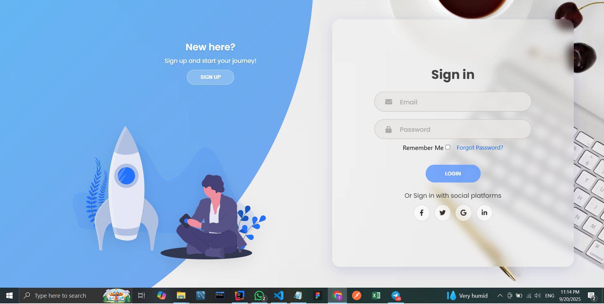
*Secure login with JWT authentication and forgot password functionality*

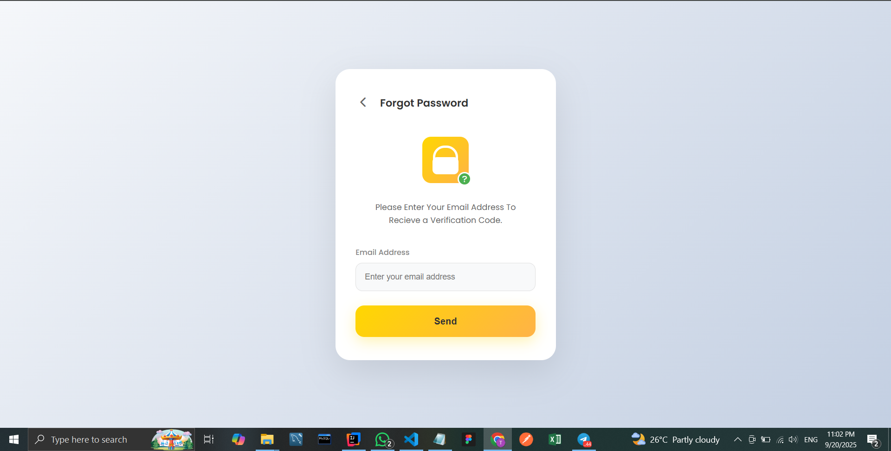
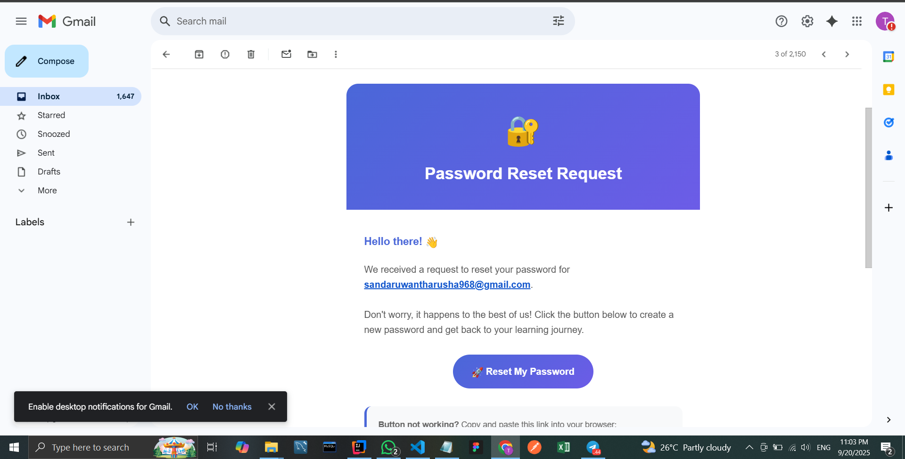
*Email-based password reset system*

### Student Dashboard
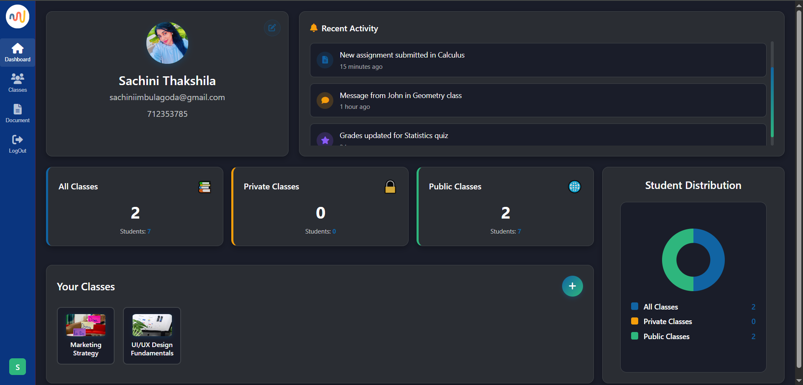
*Student dashboard showing enrolled classes and quick access features*

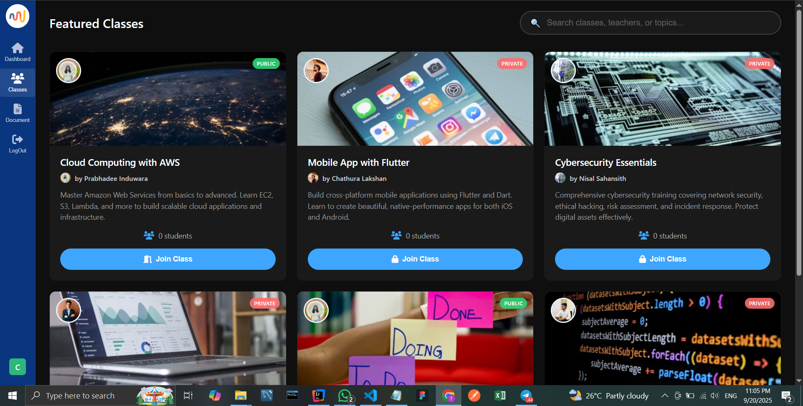
*Browse and join available classes with search, filter, and public/private class options*

### Class Management
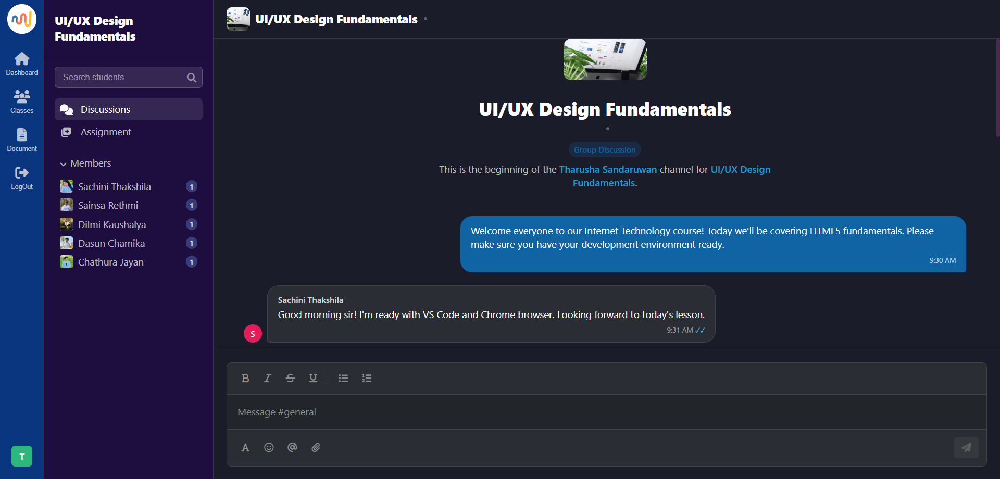
*Real-time group discussion and communication within classes*

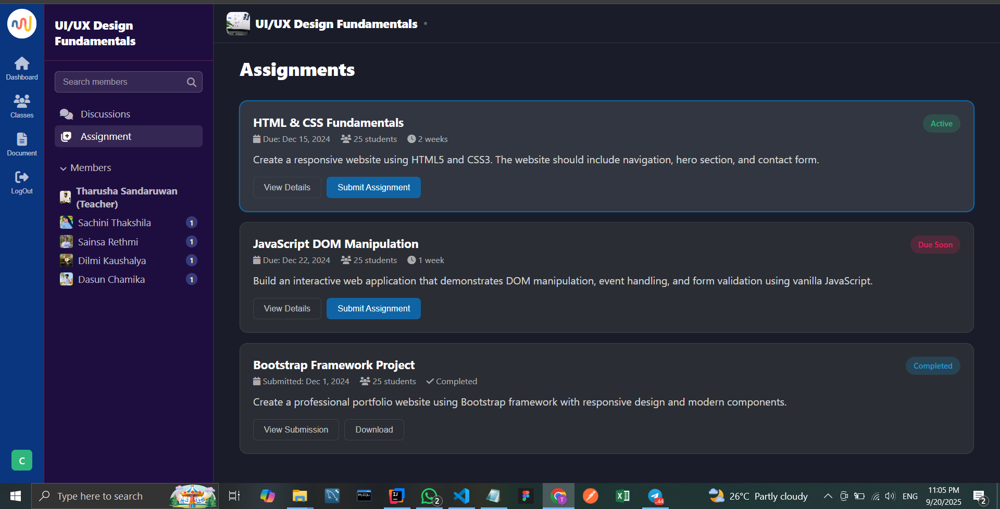
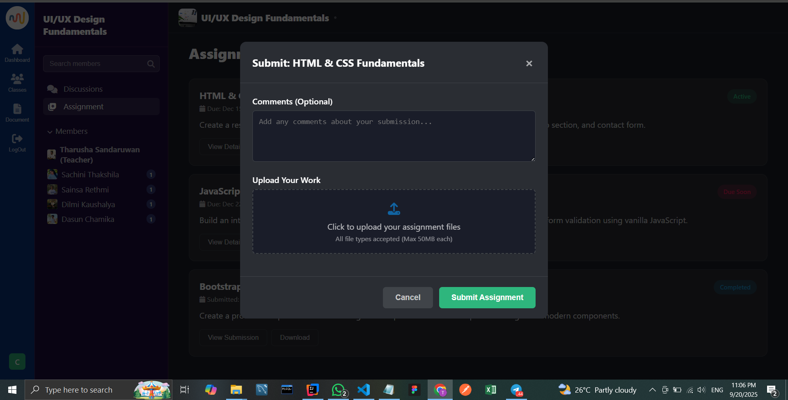
*Assignment submission interface with file upload capabilities*

### Template Creation System
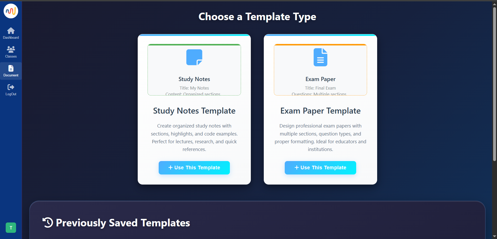
*Custom template creation for notes and exam papers with multiple question types*

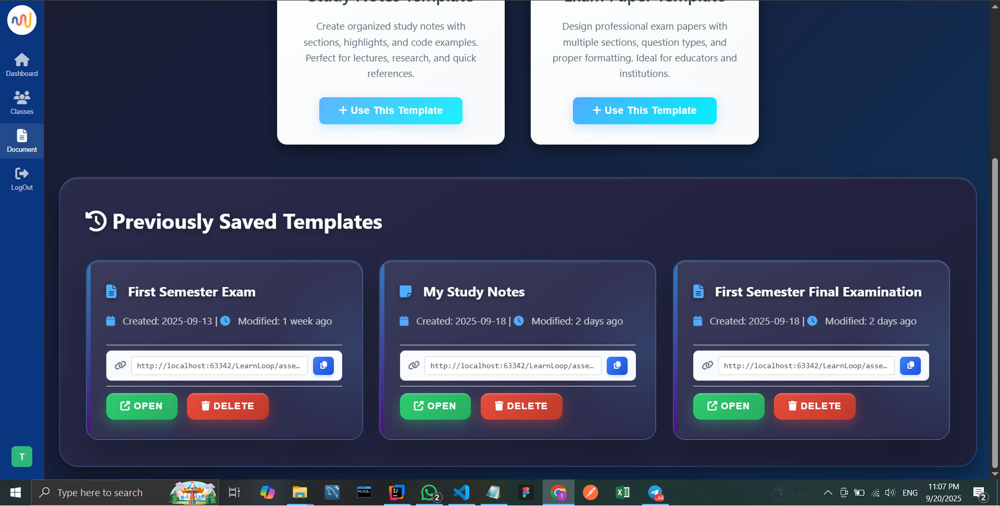
*PDF export and link sharing functionality for templates and history tracking*

### Teacher Dashboard

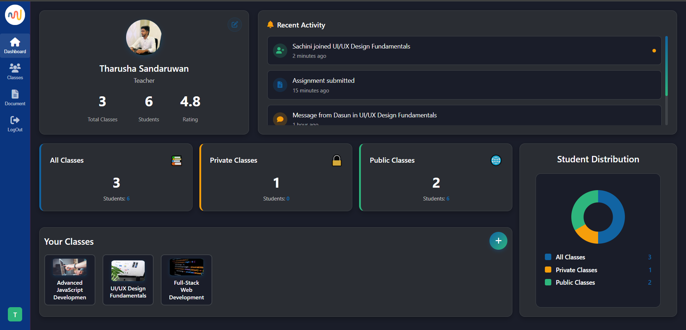
*Teacher dashboard with class management and student monitoring tools*

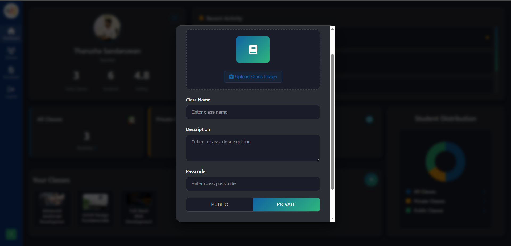
*Create classes with privacy settings and passcode protection*

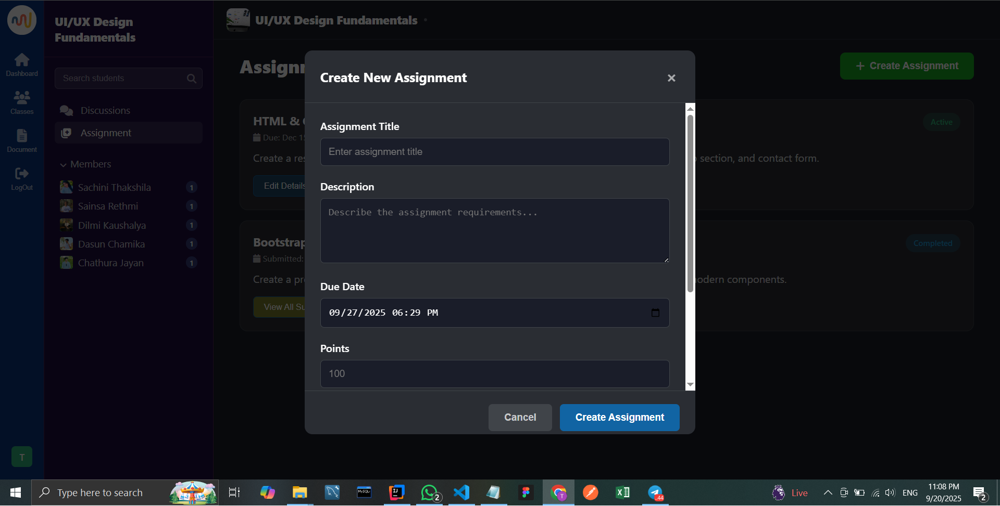
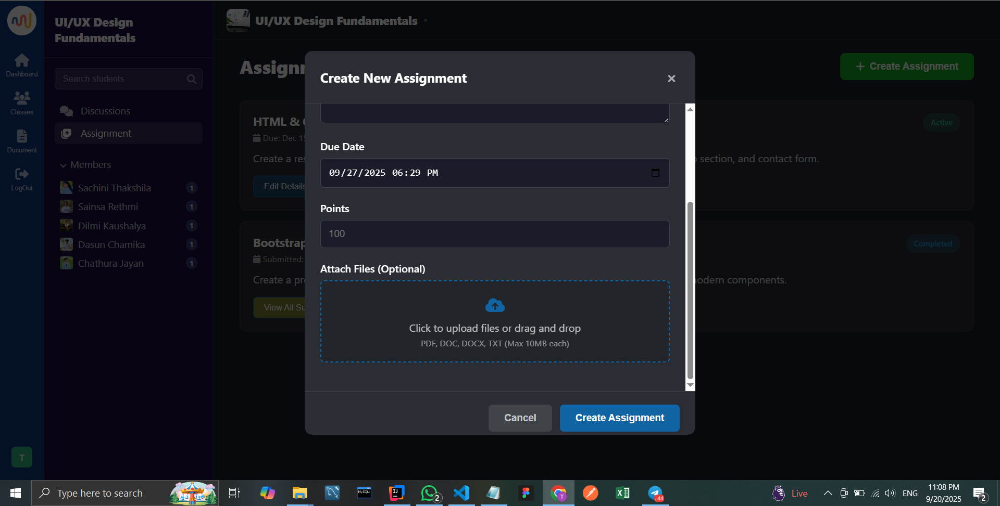
*Create assignments with deadlines, descriptions, and file attachments*

### Profile Management
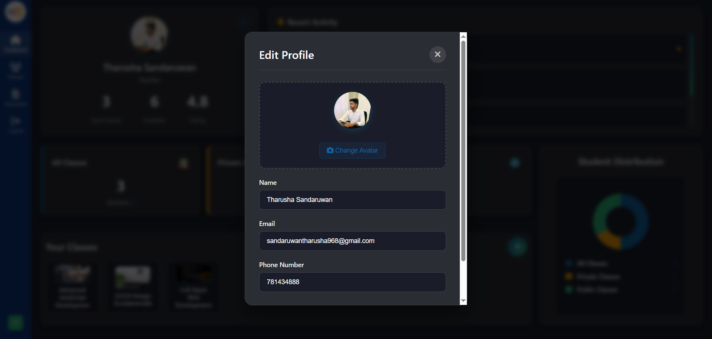
*User profile management with secure update functionality*

## Setup Instructions

### Prerequisites
- Java 17 or higher
- Maven 3.6+
- MySQL 8.0+
- Modern web browser
- IDE (IntelliJ IDEA, Eclipse, or VS Code)
- Cloudinary account (for file uploads)
- Gmail account (for email services)

### Backend Setup (Spring Boot)

1. **Clone the Repository**
   ```bash
   git clone https://github.com/tharu-2003/LearnLoop.git
   cd LearnLoop
   ```

2. **Database Configuration**
   - Ensure MySQL is running on your system
   - The application will automatically create the `LearnLoop` database
   - Update `src/main/resources/application.properties` if needed:
   ```properties
   # Database Settings
   spring.datasource.driver-class-name=com.mysql.cj.jdbc.Driver
   spring.datasource.username=root
   spring.datasource.password=your_mysql_password
   spring.datasource.url=jdbc:mysql://localhost:3306/LearnLoop?createDatabaseIfNotExist=true
   spring.datasource.hikari.maximum-pool-size=10

   # JPA Settings
   spring.jpa.generate-ddl=true
   spring.jpa.show-sql=true
   spring.jpa.database-platform=org.hibernate.dialect.MySQLDialect
   spring.jpa.hibernate.ddl-auto=update
   ```

3. **Configure Cloudinary (File Upload Service)**
   ```properties
   # Cloudinary Configuration
   cloudinary.cloud_name=your_cloud_name
   cloudinary.api_key=your_api_key
   cloudinary.api_secret=your_api_secret
   ```

4. **Configure Email Service (Gmail SMTP)**
   ```properties
   # Email Settings
   spring.mail.username=your_gmail@gmail.com
   spring.mail.password=your_app_specific_password
   spring.mail.host=smtp.gmail.com
   spring.mail.port=587
   spring.mail.properties.mail.smtp.auth=true
   spring.mail.properties.mail.smtp.starttls.enable=true
   ```

5. **JWT Configuration**
   ```properties
   # Token Data
   jwt.expiration=86400000
   jwt.secret=your_jwt_secret_key
   ```

6. **File Upload Configuration**
   ```properties
   # File upload settings
   spring.servlet.multipart.max-file-size=10MB
   spring.servlet.multipart.max-request-size=10MB
   spring.servlet.multipart.enabled=true
   spring.servlet.multipart.location=uploads/
   ```

7. **Install Dependencies and Run**
   ```bash
   mvn clean install
   mvn spring-boot:run
   ```
   The backend server will start on `http://localhost:8080`

### Frontend Setup

1. **Configure API Base URL**
   - Open `src/main/resources/static/js/config.js` (or similar configuration file)
   - Verify the API base URL:
   ```javascript
   const API_BASE_URL = 'http://localhost:8080';
   const API_ENDPOINTS = {
     register: `${API_BASE_URL}/auth/register`,
     login: `${API_BASE_URL}/auth/login`
   };
   ```

2. **CORS Configuration**
   The backend is already configured for CORS with these origins:
   ```java
   configuration.setAllowedOrigins(Arrays.asList(
       "http://127.0.0.1:5501",  // Live Server
       "http://localhost:5501"   // Alternative URL
   ));
   ```

3. **Serve Frontend Files**
   - **Option 1: Using Spring Boot (Recommended)**
     - Frontend files are served by Spring Boot
     - Access at `http://localhost:8080`
   
   - **Option 2: Using Live Server (Development)**
     - Use VS Code Live Server extension
     - Right-click on `index.html` and select "Open with Live Server"
     - Typically runs on `http://127.0.0.1:5501`

### Complete Application Setup

1. **Start the Backend**
   ```bash
   cd LearnLoop
   mvn spring-boot:run
   ```

2. **Access the Application**
   - **Via Spring Boot**: `http://localhost:8080`
   - **Via Live Server**: `http://127.0.0.1:5501` (if using separate frontend)

3. **Test the Application**
   - Create a teacher account and student account
   - Test class creation, joining, and communication features
   - Try the template creation and PDF export functionality
   - Test file upload and email notification features

### Environment Configuration Details

#### Key Security Features
- JWT token-based authentication with configurable expiration
- Password encryption using Spring Security
- CORS protection with specific allowed origins
- Secure file upload handling with size limits

#### Database Schema
- Automatic table creation via Hibernate DDL
- User management with role-based access (TEACHER/STUDENT)
- Class and assignment relationship mapping
- Template and file storage references

#### API Endpoints Structure
```
/auth/**                    - Authentication endpoints (public)
/api/classes/**            - Class management (authenticated)
/auth/assignments/**        - Assignment operations (authenticated)
/auth/documents/**          - Template CRUD operations (authenticated)
/api/chats/**             - chat management (authenticated)
```

### Troubleshooting

**Common Issues:**

1. **Database Connection Error**
   ```bash
   # Verify MySQL is running
   sudo systemctl status mysql
   # Check if database exists
   mysql -u root -p -e "SHOW DATABASES;"
   ```

2. **Email Service Issues**
   - Use Gmail App Password instead of regular password
   - Enable 2-step verification in Gmail
   - Generate app-specific password in Google Account settings

3. **File Upload Problems**
   - Verify Cloudinary credentials are correct
   - Check internet connectivity for Cloudinary API
   - Ensure uploads/ directory has write permissions

4. **CORS Errors**
   - Verify frontend URL matches allowed origins in SecurityConfig
   - Check browser console for specific CORS error messages
   - Update CORS configuration if using different ports

5. **JWT Token Issues**
   - Verify JWT secret key is properly configured
   - Check token expiration settings
   - Clear browser storage if authentication fails

### Production Deployment

1. **Environment Variables**
   ```bash
   export DB_PASSWORD=your_production_db_password
   export JWT_SECRET=your_production_jwt_secret
   export CLOUDINARY_API_SECRET=your_cloudinary_secret
   export MAIL_PASSWORD=your_production_mail_password
   ```

2. **Build Production JAR**
   ```bash
   mvn clean package -DskipTests
   java -jar target/Back_End-0.0.1-SNAPSHOT.jar
   ```

3. **Database Migration**
   - Change `hibernate.ddl-auto` to `validate` in production
   - Use proper database migration tools for schema changes

## Demo Video

🎥 **Watch the complete project demonstration:**

[**LearnLoop Student Management System - GDSE 72 - Tharusha Sandaruwan Dahanayaka**](https://youtube.com/your-video-link](https://youtu.be/-dFuGJIvC0s))

The demo video showcases:
- Complete authentication flow with role-based access
- Student dashboard and class joining process
- Real-time group discussions and messaging
- Assignment submission with file uploads
- Template creation system with PDF export
- Teacher dashboard and class management tools
- Backend architecture and security implementation
- Live demonstrations of all key features

---

**🎓 Academic Project Details**
- **Developer:** Tharusha Sandaruwan Dahanayaka  
- **Batch:** GDSE 72
- **Institution:** IJSE (Institute of Java Software Engineering)
- **Project Type:** Final Year Project
- **Repository:** [LearnLoop on GitHub](https://github.com/tharu-2003/LearnLoop.git)

**📧 Contact Information:**
- Email: sandaruwantharusha968@gmail.com
- GitHub: [@tharu-2003](https://github.com/tharu-2003)

---
⭐ **If you find this project useful, please give it a star on GitHub!**
